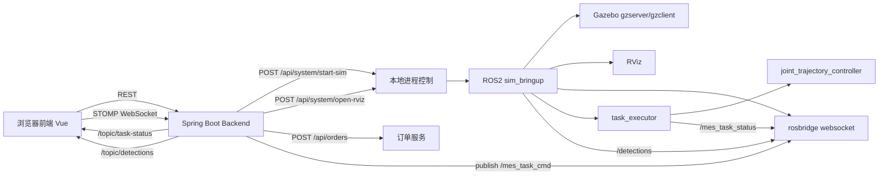

# GUI 演示操作清单（2026-03-16）

## 目标

通过前端界面完成以下演示，不再依赖终端手动下发工单：

1. 前端按钮启动 Gazebo 仿真
2. 前端按钮打开 RViz
3. 前端按钮连接 WebSocket
4. 前端界面创建工单并直接下发
5. Gazebo / RViz / 前端状态流同时可见

## 前置条件

1. WSLg 图形链正常
2. 后端已启动：`http://127.0.0.1:8080`
3. 前端已启动：`http://127.0.0.1:5173`
4. 当前版本前端已集成 `System Control` 面板

## GUI 操作步骤

1. 浏览器打开 `http://127.0.0.1:5173`
2. 在 `仿真与可视化启动` 面板点击 `启动 Gazebo 仿真`
3. 等待状态灯显示：
   - `仿真主链 -> 运行中`
   - `Gazebo -> 已打开`
4. 点击 `打开 RViz`
5. 等待状态灯显示：
   - `RViz -> 已打开`
6. 在 `链路控制` 面板点击 `连接 WebSocket`
7. 确认：
   - `rosbridge -> 在线`
   - `WebSocket -> 已连接`
8. 在 `创建与下发工单` 面板填写新工单 ID
9. 动作模板选择 `pick_place_default`
10. 点击 `创建工单`
11. 点击 `直接下发`
12. 观察：
   - Gazebo 中机械臂执行动作
   - RViz 中关节姿态同步变化
   - 前端 `结构化状态流` 出现 `STARTED -> STEP -> OK`
   - `Focused Order` 最终为 `DONE / OK`

## 当前推荐演示模板

- 稳定成功：`pick_place_default`
- 条件触发：`pick_place_red` / `pick_place_blue`

说明：
- `pick_place_red` 和 `pick_place_blue` 依赖检测输入。
- 如果页面尚未收到对应颜色检测，执行器会返回 `DETECTION_MISMATCH`。
- 阶段演示优先使用 `pick_place_default`。

## 实测结果

本次通过前端可视化按钮已真实跑通：

- 工单：`order-gui-1773629516623`
- requestId：`req-1773629549914`
- 最终状态：`DONE`
- 最终状态码：`OK`

后端查询结果：

```json
{
  "orderId": "order-gui-1773629516623",
  "actionTemplateId": "pick_place_default",
  "state": "DONE",
  "message": "Task completed",
  "lastRequestId": "req-1773629549914",
  "lastStatusCode": "OK"
}
```

## 相关证据

- `docs/evidence/browser/gui-system-panel-open.png`
- `docs/evidence/browser/gui-flow-initial.png`
- `docs/evidence/browser/gui-flow-system-ready.png`
- `docs/evidence/browser/gui-flow-order-done.png`

## 架构图



## 当前边界

当前前端已支持：

1. 启动 Gazebo 仿真
2. 打开 RViz
3. 停止仿真
4. 查看系统状态
5. 创建与下发工单
6. 查看状态流与检测流

当前仍未前端化的部分：

1. Backend 自身启动
2. Frontend 自身启动
3. 一键冷启动整个演示栈

如果要继续产品化，下一步应补：

1. `POST /api/system/start-backend` 这一类外层控制一般不需要，因为 backend 已是控制层本身
2. 增加启动前环境自检（DISPLAY/WSLg/ROS overlay）
3. 在前端增加“系统诊断”面板，明确提示哪个环节未满足
